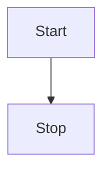

# Stuff'em

Feed me a markdown file that has a list of links to other markdown files, like this:

```
npx stuffem index.md
```

where `index.md`:

```
- [First chapter](./chap1.md)
- [Second chapter](./chap2.md)
```

Out you get an `index.html`.

By the way, supports mermaidjs.



